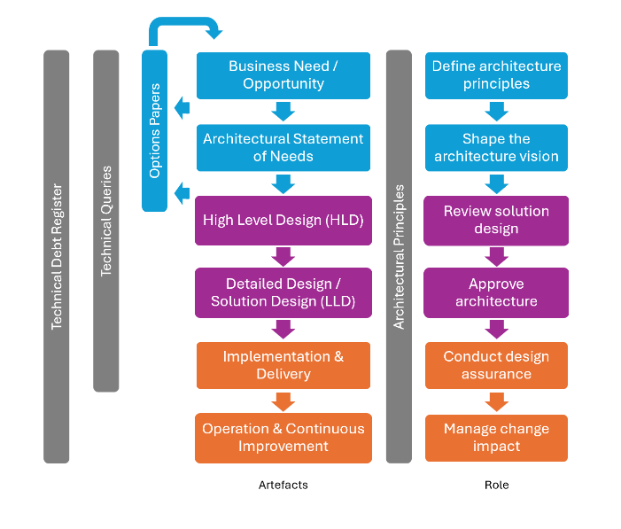

# Operating Model for IT Architecture 

## Purpose

The purpose of the operating model is to enable business agility and technical excellence by aligning architecture decisions with strategic outcomes, while ensuring workloads meet reliability, security, and operational standards.

## Scope

### Architecture Owns

*   Architecture governance
*   Standards
*   Technology roadmap
*   Architectural runway

### Architecture Influences

*   Solution design
*   Operational practices
*   Cloud adoption patterns

## Roles

### Core Responsibilities

Architects are primarily responsible for ensuring that technology solutions are:

*   Secure and compliant with organisational and regulatory standards
*   Scalable and resilient, supporting operational continuity
*   Aligned with enterprise architecture principles ensuring interoperability and minimising technical debt

Their work underpins the integrity of core systems and services, which is essential for safeguarding data and maintaining business continuity.

Core responsibilities include:

*   Designing and validating technical architectures for new and existing systems
*   Assessing risks and implementing controls to maintain system assurance
*   Collaborating with security teams to embed cybersecurity best practices
*   Providing governance and technical oversight during solution delivery

### Enterprise Architect

_Acts at the Team, Portfolio and Organisation Level_
*   Aligns architecture with business strategy, manages technology vision, and guides investment decisions

### Solution Architect

_Acts at the Solution and Project Level_
*   Coordinates architecture across multiple Value Streams and Projects ensuring solution and project integrity

### System Architect

_Acts at the Product and System Level_
*   Embedded in Value Streams, Projects and Operations providing technical guidance, enforcement of architectural principles and governance, and a point to operational escalation and support

## Governance

### Principle-Driven

Governance is anchored upon [architecture principles](https://github.com/buildbod/Architecture/blob/main/Templates/Principles/README.md) which set the standards for procurement, design, compliance, resilience, interoperability, and technical diversity.

### Terms of Reference

Architects are engaged from project inception through delivery, providing design assurance, strategic alignment, and governance participation as defined in [Terms of Reference](https://github.com/buildbod/Architecture/blob/main/Templates/Terms%20of%20Reference/README.md). The Terms of Reference contains broader project roles for context and delivery, ensuring all stakeholders understand their responsibilities and the architectural touchpoints. Decision rights and escalation paths should be documented at project initiation.

### Review Cadence

Architecture reviews are conducted at key lifecycle stages (e.g. procurement and renewals, options papers, HLD, LLD, implementation, and changes) ensuring traceability and compliance.

### Five Pillars

Architecture will be ‘well-articulated’ and supported by five pillars:

*   **Reliability** – Resilient workloads with redundancy and recovery strategies
*   **Security** – Zero Trust principles and protection of confidentiality, integrity, and availability
*   **Cost Optimisation** – Efficiency and avoidance of waste through governance and automation
*   **Operational Excellence** – Standardisation of processes, appropriate application of DevOps, and understanding through observability
*   **Performance Efficiency** – Scale dynamically and practically with optimisation of resources

Architecture governance spans from business need to continuous improvement, supported by principles, roles, and artifacts. The diagram below illustrates how key architectural artefacts relate to each other:

**Principles, Roles and Artefacts**

*   Architectural Principles underpin every stage, ensuring consistency and alignment.
*   Options Papers can emerge from a business need or trigger a reassessment of the need, creating a feedback loop.
*   A [Technical Query (TQ)](https://github.com/buildbod/Architecture/blob/main/Templates/Technical%20Queries/README.md) is a formal request for clarification, additional information, or resolution of a design or implementation issue that cannot be addressed informally. TQs can arise at any point in the lifecycle.
*   Artefacts evolve iteratively; governance ensures alignment at each stage.

## Ways of Working

Industry best practice advocates close alignment between IT Architects and the organisation they serve. Architecture’s accountability for safeguarding systems, data, and maintaining operational continuity makes its anchoring within IT logical, enabling it to manage technology risk effectively. This positioning ensures architecture underpins IT’s ability to function and supports organisational success.

Architects operate as strategic partners to the organisation, ensuring technology decisions align with business outcomes and technical standards. Their ways of working combine principle-driven governance with collaborative delivery, anchored in these practices:

### Alignment with Enterprise Strategy

Architects will align technology decisions with organisational objectives. Enterprise Architects will set strategic direction and governance, while Solution and System Architects will translate principles into practical, secure, and resilient solutions that deliver business value.

### Continuous Engagement Across the Lifecycle

Architects will engage from inception through delivery, providing design assurance and governance at every stage. They will shape business needs and opportunities as well as options papers, validate high-level and detailed designs, support implementation, and manage change impact to maintain architectural and operational integrity.

### Cross-Functional Collaboration

Architects will work closely with delivery teams, security specialists, and operations to ensure interoperability, compliance, and risk mitigation. They will foster transparency, accelerate decision-making, and embed architectural principles into day-to-day delivery practices.

### Focus on System Assurance and Resilience

Architecture’s accountability for safeguarding systems, data and maintaining operational continuity makes its anchoring within IT logical, enabling it to manage technology risk effectively.

### Principle-Driven Decision Making

Architects will anchor all decisions in documented principles and apply the Five Pillars. These guardrails will ensure consistency, compliance, and alignment with organisational need and strategy.

### Design Approach

Architects will balance intentional design with emergent architecture and enabling agility without sacrificing integrity. This approach will support iterative delivery while maintaining a clear architectural vision.

### Operational Excellence

Architects will champion automation, observability, and standardised processes to improve resilience, performance, and maintainability. By embedding these practices, they will reduce operational risk and accelerate continuous improvement.

## Measurement

The architecture team will use a structured maturity model to assess and improve its practices across the Five Pillars. Regular self-assessments and reviews will identify strengths, gaps, and opportunities for improvement. Progress will be tracked over time, with actionable recommendations guiding the team’s evolution toward higher levels of architectural excellence and business value.

As the team matures, it will develop and refine key performance indicators (KPIs) that reflect architectural impact and value. Observability practices – such as monitoring, automated metrics collection, and feedback loops – will inform these KPIs, ensuring that measurement is objective, data-driven, and aligned with operational realities. This approach supports continuous improvement and transparent reporting to stakeholders.

## Linkage to Known Practices

This operating model aligns with globally recognised frameworks and best practices to ensure consistency, scalability, and resilience:

- **SAFe (Scaled Agile Framework)**

Supports lean-agile principles and portfolio-level governance, enabling architecture to integrate with agile delivery at scale.

- **Microsoft Well-Architected Framework**

Provides guidance across five pillars - Reliability, Security, Cost Optimisation, Operational Excellence, and Performance Efficiency - which are mirrored in the governance model.

- **TOGAF (The Open Group Architecture Framework)**

Offers a structured approach for enterprise architecture, including the Architecture Development Method (ADM) and governance practices that underpin our principles and artefacts.

