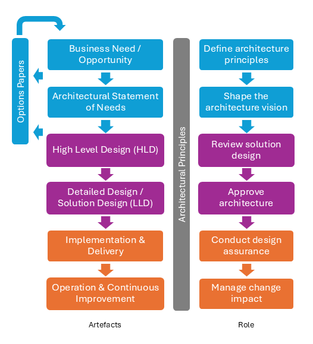

# Architectural Terms of Reference

## Purpose

To define the default position, responsibilities, and engagement model for architects within projects, ensuring clarity for both architects and those they serve. This document supports consistent design assurance, governance, and alignment with enterprise standards.

## Default Position

Architects are engaged from the earliest stages of a project and remain involved throughout the lifecycle. Their default role includes:

- **Strategic alignment** with enterprise principles and standards
- **Design assurance** to validate robustness and feasibility
- **Governance participation** to ensure traceability and compliance
- **Collaboration** with delivery teams and suppliers

This position is informed by TOGAF’s ADM lifecycle, SAFe’s architectural runway, and broader enterprise architecture practices.

## Engagement Model

The following diagram illustrates the default engagement model, aligning **Artefacts**, **Roles**, and **Architectural Principles** across the project lifecycle:

**Architectural Principles** act as governance throughout all phases. The flow ensures that artefacts and roles are synchronized, reducing ambiguity and late-stage rework.

*Technical queries can occur at any stage and are a cross-cutting activity.* They should be directed to the relevant architect for resolution.

**Lessons learned** from each engagement should be captured and used to refine future Terms of Reference. Feedback loops with stakeholders are essential to evolve architectural practices.

## Roles and Responsibilities

The following table clarifies the responsibilities of each role throughout the architectural engagement lifecycle. Architects provide assurance and guidance, but do not hold formal authority within business processes. Decision rights and escalation paths should be agreed at project initiation and documented as part of project governance.

### Role Descriptions

- **Enterprise Architect:** Accountable for architectural integrity, governance, and alignment with enterprise standards. Provides strategic direction and ensures traceability across the lifecycle.
- **Solution Architect:** Responsible for shaping the architecture vision, developing solution designs, and conducting design assurance. Acts as the primary technical lead for solution delivery.
- **Supplier:** Responsible for implementing and operationalising the solution design. Provides input during design reviews and collaborates on technical queries.
- **Project Manager:** Consulted on timelines, dependencies, and delivery coordination. Supports change management and ensures project objectives are met.
- **Business Owner:** Accountable for business outcomes and benefits realization. Consulted on requirements, vision, and sign-off of key deliverables.

### Definitions of Responsibilities
- **Design Assurance:** Architects validate and guide design decisions but do not own delivery.
- **Solution Ownership:** Delivery teams and suppliers own implementation and operationalisation.
- **Decision Rights:** Decision rights for architectural matters should be explicitly agreed and documented at project initiation. Where architects are not the decision-makers, their recommendations should be considered as part of the governance process.
- **Escalation:** In cases of disagreement or uncertainty, escalation should follow the governance path defined for the project (e.g., to the Architecture Board or Programme Steering Group).

Clear boundaries must be maintained to ensure accountability and reduce friction.

### RACI Matrix

| Activity                      | Enterprise Architect | Solution Architect | Supplier | Project Manager | Business Owner |
|-------------------------------|:-------------------:|:-----------------:|:--------:|:---------------:|:-------------:|
| Define architecture principles| A                   | C                 | I        | I               | C             |
| Shape architecture vision     | A                   | R                 | C        | C               | A             |
| Review solution design        | R                   | A                 | R        | C               | I             |
| Approve architecture          | A                   | R                 | C        | I               | A             |
| Conduct design assurance      | R                   | A                 | R        | C               | I             |
| Manage change impact          | A                   | R                 | C        | R               | I             |

## Linkage to Known Practices

This Terms of Reference aligns with established frameworks:

- **TOGAF (The Open Group Architecture Framework):**
  - Engagement reflects TOGAF ADM phases: Preliminary (principles), Architecture Vision (strategy), Business/Data/Application/Technology Architecture (design), and Implementation Governance.
  - Emphasis on governance checkpoints and traceability mirrors TOGAF’s Architecture Board reviews.

- **SAFe (Scaled Agile Framework):**
  - Incorporates the concept of the Architecture Runway to ensure technical foundations are in place before delivery.
  - Supports intentional architecture while enabling emergent design through iterative options papers and design assurance.

- **Enterprise Architecture Best Practices:**
  - Maintains clear separation between design assurance and solution ownership.
  - Embeds architects as strategic advisors and governance leads throughout the lifecycle.

This linkage ensures that the engagement model is not only practical but also consistent with globally recognized standards.
